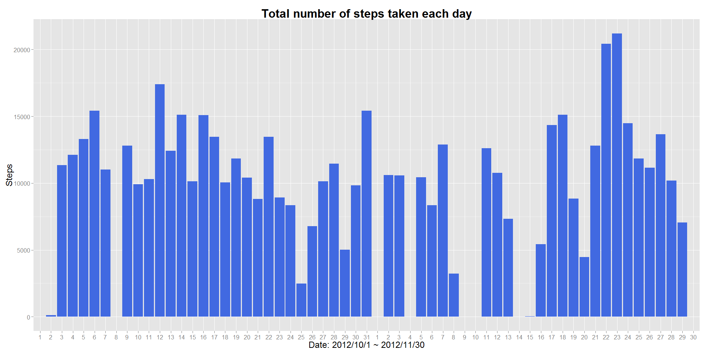
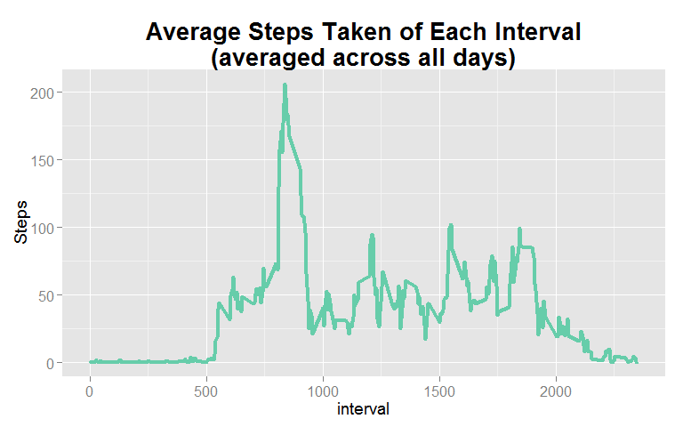
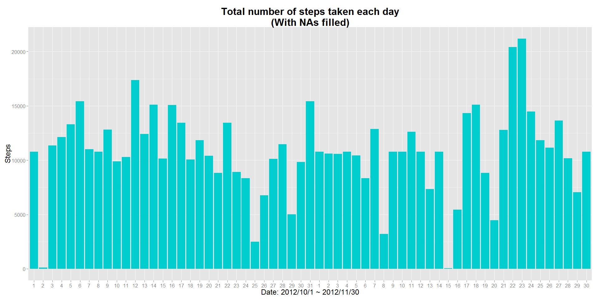
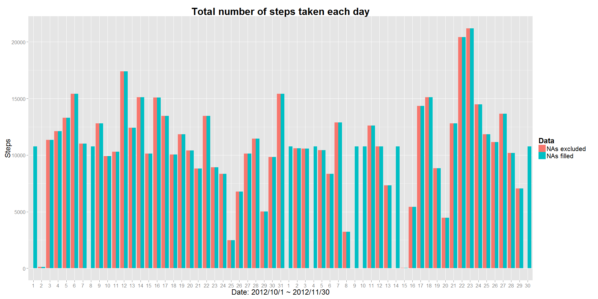
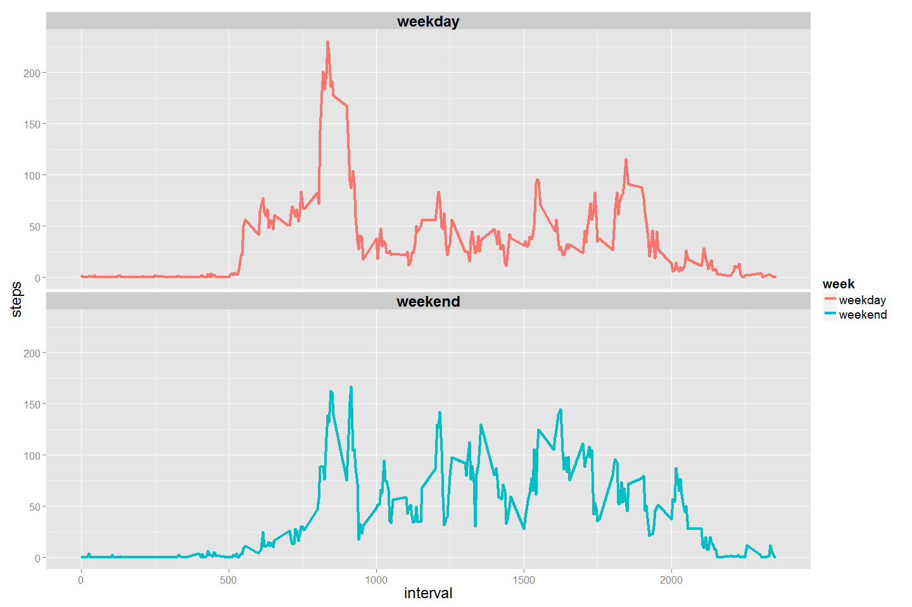

# Reproducible Research: Peer Assessment 1

## 1. Loading and preprocessing the data  

- Set out the required environment.

```r
suppressMessages( library(data.table) )
suppressMessages( library(dplyr) )
suppressMessages( library(plyr)  )
library(reshape2)
library(ggplot2)

setwd("C:/Users/ASUS/RepData_PeerAssessment1")
unzip("activity.zip")
```

- Read in the files, create the dataset `DT`.

```r
files <- list.files()
DT    <- fread( files[1], stringsAsFactors = FALSE ) ; DT
```

```
##        steps       date interval
##     1:    NA 2012-10-01        0
##     2:    NA 2012-10-01        5
##     3:    NA 2012-10-01       10
##     4:    NA 2012-10-01       15
##     5:    NA 2012-10-01       20
##    ---                          
## 17564:    NA 2012-11-30     2335
## 17565:    NA 2012-11-30     2340
## 17566:    NA 2012-11-30     2345
## 17567:    NA 2012-11-30     2350
## 17568:    NA 2012-11-30     2355
```


## 2. What is mean total number of steps taken per day?

- Create the dataset `totalstepsByDay`.

```r
totalstepsByDay <- DT[ , list( Steps = sum( steps, na.rm = TRUE ) ) , by = date ]
head(totalstepsByDay)
```

```
##          date Steps
## 1: 2012-10-01     0
## 2: 2012-10-02   126
## 3: 2012-10-03 11352
## 4: 2012-10-04 12116
## 5: 2012-10-05 13294
## 6: 2012-10-06 15420
```

#### 2-1. Make a histogram of the total number of steps taken each day

- Create a function `totalStepPlot( data = data to plot the graph ; fillcolor = color of the bar ; plottitle = title of the plot )`.  
- Change the labels of x-axis to just day to prevent them from clumping together.
- Plot the histogram using the dataset `totalstepsByDay`.
- The function will also be used for question 4-4.

```r
totalStepPlot <- function( data, fillcolor, plottitle )
{
    ggplot( data, aes( x = date, y = Steps ) ) + geom_histogram( stat = "identity", fill = fillcolor ) +  
      ggtitle( plottitle ) + xlab( "Date: 2012/10/1 ~ 2012/11/30" ) + theme(
        plot.title = element_text( size = 24, face = "bold" ),
        axis.title = element_text( size = 18 ),
        axis.text  = element_text( size = 12 )) + scale_x_discrete( labels = c( seq(1,31), seq(1,30) ) )
}
totalStepPlot(totalstepsByDay, "royalblue", "Total number of steps taken each day" )
```

 

#### 2-2. Calculate and report the mean and median total number of steps taken per day

- Create a function `detail` to see that with one single call.
- The function will also be used for question 4-4.

```r
detail <- function(x)
{
    fun <- list( mean = mean, median = median )
    lapply(fun, function(f){ f(x) } )
}
( detail1 <- unlist( detail(totalstepsByDay$Steps) ) )
```

```
##     mean   median 
##  9354.23 10395.00
```
 
 
 
## 3. What is the average daily activity pattern?

#### 3-1. Make a time series plot (i.e. type = "l") of the 5-minute interval (x-axis), and the average number of steps taken, averaged across all days (y-axis)

- Create the dataset `averagesteps`.

```r
averagesteps <- DT[, list( mean = mean( steps, na.rm = TRUE ) ), by = interval ]
head(averagesteps)
```

```
##    interval      mean
## 1:        0 1.7169811
## 2:        5 0.3396226
## 3:       10 0.1320755
## 4:       15 0.1509434
## 5:       20 0.0754717
## 6:       25 2.0943396
```

- Plot the line graph using the dataset `averagesteps`

```r
ggplot( averagesteps, aes( x = interval, y = mean ) ) + geom_line( size = 1.5, color = "aquamarine3" ) +
  ggtitle( "Average Steps Taken of Each Interval\n(averaged across all days)" ) + ylab( "Steps" ) + theme(
    plot.title   = element_text( size = 20, face = "bold" ),
    axis.title   = element_text( size = 14 ),
    axis.text    = element_text( size = 12 ))
```

 

#### 3-2. Which 5-minute interval, on average across all the days in the dataset, contains the maximum number of steps?


```r
filter( averagesteps, mean == max(mean) )$interval
```

```
## [1] 835
```


## 4. Imputing missing values

#### 4-1. Calculate and report the total number of missing values in the dataset, (i.e. the total number of rows with NAs)


```r
sum( is.na(DT$steps) )
```

```
## [1] 2304
```

#### 4-2. Devise a strategy for filling in all of the missing values in the dataset. The strategy does not need to be sophisticated. For example, you could use the mean/median for that day, or the mean for that 5-minute interval, etc.

- Fill in the NAs with **the mean for that 5-minute interval**, and pass it to `NA_fill`.

```r
NA_fill <- averagesteps$mean[ match( DT[ !complete.cases(DT) ]$interval , averagesteps$interval ) ] 
head(NA_fill)
```

```
## [1] 1.7169811 0.3396226 0.1320755 0.1509434 0.0754717 2.0943396
```

#### 4-3. Create a new dataset that is equal to the original dataset but with the missing data filled in.

- Create the new dataset `DT1`.
- Convert the steps from integer class to numeric
- Pass `NA_fill` to it

```r
DT1       <- DT
DT1$steps <- sapply( DT1$steps, as.numeric )
DT1[ !complete.cases(DT1) ]$steps <- NA_fill ; DT1
```

```
##            steps       date interval
##     1: 1.7169811 2012-10-01        0
##     2: 0.3396226 2012-10-01        5
##     3: 0.1320755 2012-10-01       10
##     4: 0.1509434 2012-10-01       15
##     5: 0.0754717 2012-10-01       20
##    ---                              
## 17564: 4.6981132 2012-11-30     2335
## 17565: 3.3018868 2012-11-30     2340
## 17566: 0.6415094 2012-11-30     2345
## 17567: 0.2264151 2012-11-30     2350
## 17568: 1.0754717 2012-11-30     2355
```


#### 4-4. Make a histogram of the total number of steps taken each day and Calculate and report the mean and median total number of steps taken per day. Do these values differ from the estimates from the first part of the assignment? What is the impact of imputing missing data on the estimates of the total daily number of steps?

- The dataset without filling in the NAs is `totalstepsByDay` .
- The new dataset that has the NAs filled with **the mean for that 5-minute interval** is `totalstepsByDay1`.


```r
totalstepsByDay1 <- DT1[ ,list( Steps = sum( steps, na.rm = TRUE ) ) , by = date ]
head(totalstepsByDay1)
```

```
##          date    Steps
## 1: 2012-10-01 10766.19
## 2: 2012-10-02   126.00
## 3: 2012-10-03 11352.00
## 4: 2012-10-04 12116.00
## 5: 2012-10-05 13294.00
## 6: 2012-10-06 15420.00
```

- Plot the histogram using the dataset `totalstepsByDay1`.
- Use the function `totalStepPlot( data = data to plot the graph ; fillcolor = color of the bar ; plottitle = title of the plot )`. 

```r
totalStepPlot( totalstepsByDay1, "cyan3", "Total number of steps taken each day\n(With NAs filled)" )
```

 

- Use the function `detail` to calculate the mean and median for `totalstepsByDay1`.
- Compare it with `detail1`, which is the mean and median of the dataset that NAs are not filled.

```r
detail2 <- unlist( detail( totalstepsByDay1$Steps ) )
detail3 <- list( Excluded = detail1, Filled = detail2 ) 
unlist(detail3)
```

```
##   Excluded.mean Excluded.median     Filled.mean   Filled.median 
##         9354.23        10395.00        10766.19        10766.19
```
- **Note:** When the NAs in the raw data are filled with **the mean for that 5-minute interval**, it will cause the mean and the median of the total steps per day to rise sightly.

- Plot `totalstepsByDay`,`totalstepsByDay1` in one graph to compare
- Merge the two dataset together and reshape it to be used for `ggplot`

```r
mergedata         <- merge  ( totalstepsByDay,totalstepsByDay1, by = "date" )
mergedata$Steps.x <- sapply ( mergedata$Steps.x, as.numeric )    
mergedata         <- melt   ( mergedata, id.vars = "date", value.name = "Steps", variable.name = "Data" )
mergedata$Data    <- revalue( mergedata$Data, c( "Steps.x" = "NAs excluded", "Steps.y" = "NAs filled" ) )
```

- Plot the histogram using the `mergedata`

```r
ggplot( mergedata, aes( x = date , y = Steps, fill = Data  ) ) + 
  geom_histogram( stat = "identity", position = "dodge" ) +  
  ggtitle( "Total number of steps taken each day" ) + xlab( "Date: 2012/10/1 ~ 2012/11/30" ) + theme(
    plot.title   = element_text( size = 24, face = "bold" ),
    legend.title = element_text( size = 18 ),
    legend.text  = element_text( size = 16 ),
    axis.title   = element_text( size = 18 ),
    axis.text    = element_text( size = 12 )) + scale_x_discrete( labels = c( seq(1,31), seq(1,30) ) ) 
```

 
**Conclusion:**  

1. From the graph above, you can see significant difference between the two datasets on dates such as 10/1,10/8 etc. The main cause for this is because the majority of the NA values in the raw data lays within these few days. The reason behind is probably because the activity monitoring devices were shut down by the users, therefore the devices could not keep track of the values.

2. When the NAs in the raw data are filled with the mean for that 5-minute interval, it will cause the mean and the median of the total steps per day to rise about 1411 and 370 respectively. 

3. Filling the NA values will greatly change the distribution of the total steps per day, since they all lay within a few certain days.

4. To sum up, unless we are certain of the reasons for causing those NA values, we should simply exclude these days when doing data analysis. Dropping small proportion of the data from the raw dataset should not cause havoc.


## 5. Are there differences in activity patterns between weekdays and weekends? Use the dataset with the filled-in missing values for this part.

#### 5-1. Create a new factor variable in the dataset with two levels ?V ??weekday?? and ??weekend?? indicating whether a given date is a weekday or weekend day.

- Convert the date column in `DT1` from character to date type.
- Add a new column called week referring to the weekdays of the date.


```r
DT1$date <- as.Date( DT1$date, format = "%Y-%m-%d" )
DT1[, week := weekdays(DT1$date) ] 
```

```
##            steps       date interval   week
##     1: 1.7169811 2012-10-01        0 Monday
##     2: 0.3396226 2012-10-01        5 Monday
##     3: 0.1320755 2012-10-01       10 Monday
##     4: 0.1509434 2012-10-01       15 Monday
##     5: 0.0754717 2012-10-01       20 Monday
##    ---                                     
## 17564: 4.6981132 2012-11-30     2335 Friday
## 17565: 3.3018868 2012-11-30     2340 Friday
## 17566: 0.6415094 2012-11-30     2345 Friday
## 17567: 0.2264151 2012-11-30     2350 Friday
## 17568: 1.0754717 2012-11-30     2355 Friday
```

- Convert the weekdays to just weekend and weekday and as factor.

```r
DT1$week <- ifelse( DT1$week %in% c( "Saturday", "Sunday" ), "weekend", "weekday" )
DT1$week <- sapply( DT1$week, as.factor )
head(DT1$week)
```

```
## [1] weekday weekday weekday weekday weekday weekday
## Levels: weekday weekend
```

#### 5-2. Make a panel plot containing a time series plot (i.e. type = "l") of the 5-minute interval (x-axis) and the average number of steps taken, averaged across all weekday days or weekend days (y-axis).

- Create the dataset `weeksteps`, which is the average of steps across intervals and week.

```r
weeksteps <- DT1[ , list( steps = mean( steps, na.rm = TRUE ) ), by = list( interval, week )  ]
head(weeksteps)
```

```
##    interval    week      steps
## 1:        0 weekday 2.25115304
## 2:        5 weekday 0.44528302
## 3:       10 weekday 0.17316562
## 4:       15 weekday 0.19790356
## 5:       20 weekday 0.09895178
## 6:       25 weekday 1.59035639
```

- Plot the histogram using the dataset `weeksteps`

```r
ggplot( weeksteps, aes( x = interval, y = steps, color = week ) ) + geom_line( size = 1.5 ) +
  facet_wrap( ~ week , ncol = 1 ) + theme(
    strip.text   = element_text( face = "bold", size = rel(1.5) ),
    axis.title   = element_text( size = 18 ),
    axis.text    = element_text( size = 12 ),
    legend.title = element_text( size = 16 ),
    legend.text  = element_text( size = 14 ))
```

 


